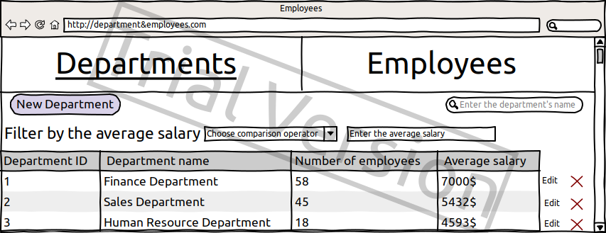
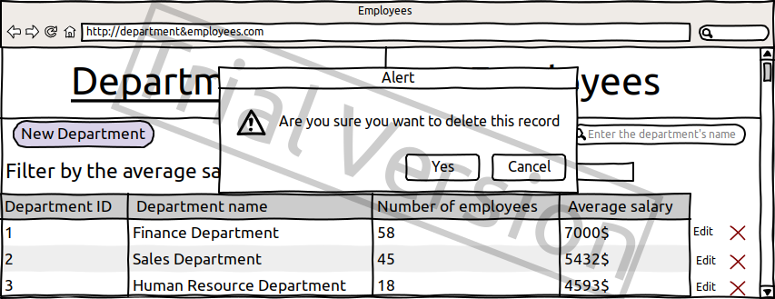

# **Departments and Employees**

## **Vision**

“Departments and Employees” is web-application which allows users to record information about departments and their employees.

Application should provide:

-   Storing departments and employees in database;
-   Displaying list of departments;
-   Displaying list of employees;
-   Updating the list of departments (adding, editing, removing);
-   Updating the list of employees (adding, editing, removing);
-   Possibility to search for employees based on their birthday or if their were born in a specific period;
-   Filtering departments by the average salary;
-   Search by username;
-   Search by department name;
-   Filter user by department name

## **Departments**

### **1.1 Display list of departments**

The mode is designed to view the list of departments.

***Main scenario:***

-   User selects item “Departments”;
-   Application displays the list of departments;

Pic 1.1 view of the Department list

The list displays the following columns:

-   Department ID – unique department number
-   Department name – human-understandable unique department name
-   Number of employees – the number of employees in the department
-   Average salary – the average salary of the departments

Aggregate function: Average salary = SUM(Emloyees.employee\_salary) / Number of employees

Filtering by the average salary:

-   User chooses a comparison operator (&lt;, &gt;, =, &lt;=, &gt;=), enters the average salary and the app filters the table;

Searching by the department's name:
-   User enters the department's name into the search field, clicks on the search sign nad then the app displays the department with the correspoding name;

### **1.2 Add Department**

***Main scenario:***

-   User clicks the “Add” button on the Departments page;
-   Application displays the form for adding department;
-   User enters department data and clicks “Save” button;
-   If any data is entered incorrectly, incorrect data message is displayed;
-   If entered data is valid, then the record is added to the database;
-   If an error occurs, then the error message is displayed;
-   If the record is added successfully, then User gets redirected to the Departments page;

Pic 1.2 Add department

***Cancel operation scenario:***

-   User clicks the “Add” button on the Departments page;
-   Application displays the form for adding department;
-   User enters department data and clicks “Cancel” button;
-   Data doesn’t save to the database and the user is redirected to the Departments page;
-   If the user selects Departments or Employees from the menu, then the data won’t be saved in the database and the corresponding page will open;

When adding a department, the following details are entered:

-   Department’s name – the name of the departments;

### **1.3 Edit Department**

***Main scenario:***

-   User clicks the “Edit” button on the Departments page;
-   Application displays form with current Department’s data;
-   User edits the department’s data and clicks “Save”;
-   If any data is entered incorrectly, the incorrect data message is displayed;
-   If entered data is valid, then the change is saved to the database;
-   If error occurs, the error message is displayed;
-   If the change is saved successfully, then the use is redirected to the departments page;

Pic 1.3 Edit department

Cancel operation scenario:

-   User clicks the “Edit” button on the Departments page;
-   Application displays form with current Department’s data;
-   User edits the department’s data and clicks “Cancel”;
-   Data doesn’t save to the database and the user is redirected back to the Departments page;
-   If the user selects Departments or Employees from the menu, then the data won’t be saved in the database and the corresponding page will open;

When editing a department, the following data can be changed:

-   Department’s name – the name of the department;

### **1.4 Removing a Department**

***Main scenario:***

-   User clicks the “Remove” button in the corresponding line;
-   Then the prompt appears asking the user to confirm removal;
-   The user confirms the removal;
-   The record is deleted from the database;
-   If error occurs, the error message is displayed;
-   If record removal went successfully, then the Departments page is displayed without the deleted record;
-   If user tries to delete a department that has employees then he is asked wether he wants to delete all the employees if not then he is not allowed to delete the department;

Pic 1.4 Remove department

***Cancel operation scenario:***

-   User clicks the “Remove” button in the corresponding line;
-   Then the prompt appears asking the use to confirm removal;
-   The user cancels the removal;
-   The Departments page is displayed without any changes;

## **Employees**

### **1.1 Display list of employees**

The mode is designed to view the list of employees.

***Main scenario:***

-   User selects item “Employees”;
-   Application displays the list of Employees;

Pic 1.1 view of the employee list

The list displays the following columns:

-   Employee ID – unique employee number;
-   Employees fullname – the full name of the employee (e.g. Andrey Semenov);
-   Department name – the name of the department that employees works in;
-   Employees salary – the salary of the employee;
-   Birthday - employee's birthday;

Filtering by birthday:

-   User chooses a date and the app filters the table only showing the employees that have this date as a birthday;

Filtering by the period of birthdays:
	User chooses two dates and the app filters the table only showing the employees that have birthday in between these two dates;
	 
### **1.2 Add Employee**

***Main scenario:***

-   User clicks the “Add” button on the Employees page;
-   Application displays the form for adding an employee;
-   User enters employee data and clicks “Save” button;
-   If any data is entered incorrectly, incorrect data message is displayed;
-   If entered data is valid, then the record is added to the database;
-   If an error occurs, then the error message is displayed;
-   If the record is added successfully, then User gets redirected to the Employees page;

Pic 1.2 Add employee

***Cancel operation scenario:***

-   User clicks the “Add” button on the Employees page;
-   Application displays the form for adding an employee;
-   User enters employee data and clicks “Cancel” button;
-   Data doesn’t save to the database and the user is redirected to the Employees page;
-   If the user selects Departments or Employees from the menu, then the data won’t be saved in the database and the corresponding page will open;

When adding a employee, the following details are entered:

-   Employee's fullname – the full name of the employee;
-   Department's name - the name of the  department that employee works in;
-   Employee's salary - the salary of the employee;
-   Employee's birthday - the date of birth of the employee;

### **1.3 Edit Employee**

***Main scenario:***

-   User clicks the “Edit” button on the Employees page;
-   Application displays form with current Employee's data;
-   User edits the employee's data and clicks “Save”;
-   If any data is entered incorrectly, the incorrect data message is displayed;
-   If entered data is valid, then the change is saved to the database;
-   If error occurs, the error message is displayed;
-   If the change is saved successfully, then the use is redirected to the employees page;

Pic 1.3 Edit employee

Cancel operation scenario:

-   User clicks the “Edit” button on the Employees page;
-   Application displays form with current Employee's data;
-   User edits the Employee's data and clicks “Cancel”;
-   Data doesn’t save to the database and the user is redirected back to the Employees page;
-   If the user selects Departments or Employees from the menu, then the data won’t be saved in the database and the corresponding page will open;

When editing an employee, the following data can be changed:

-   Employee's fullname – the full name of the employee;
-   Department's name – the name of the department that employee works in;
-   Employee's salary - the salary of the employee;
-   Employee's birthday - the date of birth of the employee;

### **1.4 Removing an Employee**

***Main scenario:***

-   User clicks the “Remove” button in the corresponding line;
-   Then the prompt appears asking the use to confirm removal;
-   The user confirms the removal;
-   The recorded is deleted from the database;
-   If error occurs, the error message is displayed;
-   If record removal went successfully, then the Employees page is displayed without the deleted record;

Pic 1.4 Remove employee

***Cancel operation scenario:***

-   User clicks the “Remove” button in the corresponding line;
-   Then the prompt appears asking the use to confirm removal;
-   The user cancels the removal;
-   The Employees page is displayed without any changes;

